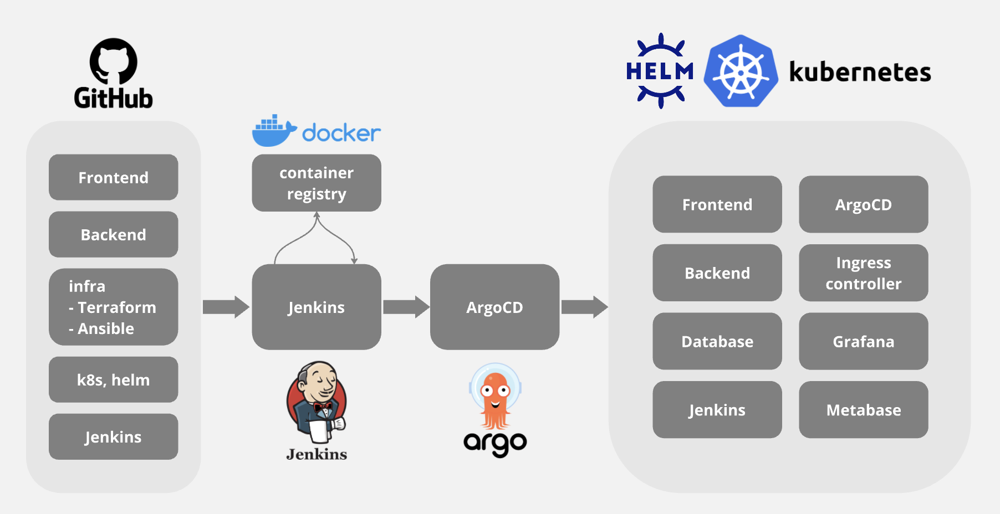
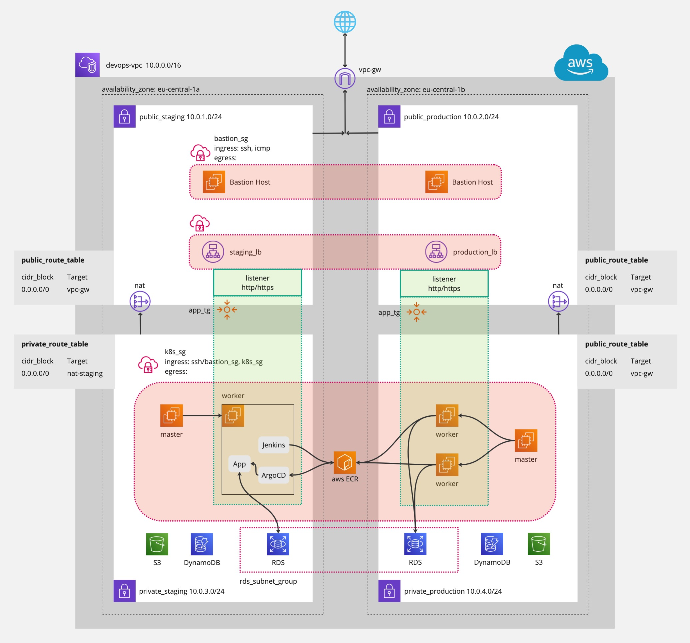

# IT-Konzept für das DevOps-Projekt: Habit Tracker

## Verwendete Repositories:
- [App(Next.js) Repository](https://github.com/xyc-tw/habit-tracker-app/tree/main)  
- [Infrastructure Repository](https://github.com/xyc-tw/habit-tracker-infra) 

## Projektübersicht

### Hintergrund
Über meine Tätigkeit habe ich erfahren, dass DevOps für eine effiziente Zusammenarbeit im Team eine zentrale Rolle spielt. Besonders in meinem aktuellen Data-Science-Team, in dem DevOps-Aufgaben ausgelagert sind, wird die Zusammenarbeit teilweise durch meine begrenzten DevOps-Kenntnisse erschwert.

Die Implementierung unserer Prototypen gestaltet sich dadurch oft weniger effizient, da eine enge Zusammenarbeit erforderlich ist. In solchen Fällen übernimmt unser Team die Implementierung selbst, wobei serverlose Dienste wie AWS eingesetzt werden—eine Aufgabe, die aktuell hauptsächlich meine Kollegen bewältigen.

Mein Ziel für diesen Kurs ist es daher, die Konzepte von DevOps umfassender zu verstehen und praktische Erfahrungen zu sammeln. Diese Kenntnisse sollen mir nicht nur die Kommunikation mit dem DevOps-Team erleichtern, sondern auch ermöglichen, im Data-Science-Team aktiver und effektiver mitzuwirken.

### Projektidee
Das Projekt „Habit Tracker“ wird im DevOps-Workflow entwickelt.

- **Idee**: Eine Website, auf der Benutzer ihre Ziele setzen und dokumentieren können.

- **Funktionen**:
  - Erstellung und Verwaltung von individuellen Zielen.
  - Fortschrittsanzeige mit Statistiken und Diagrammen.
  - Erinnerungsfunktion zur Unterstützung der Zielerreichung.
  - Gemeinschaftsbereiche für Motivation und Austausch.
  - Integration von Belohnungssystemen für erreichte Meilensteine.

- **Zielgruppe**:
  - Menschen, die persönliche oder berufliche Gewohnheiten entwickeln möchten.
  - Nutzer, die ihren Fortschritt bei Zielen verfolgen und verbessern wollen.
  - Personen, die digitale Tools für Selbstorganisation und Motivation bevorzugen.

### Projektstruktur

## Systemkomponenten

### Hardware
- Keine spezifische Hardware erforderlich (Cloud-basiertes Projekt).
  
### Software
- **App(Frontend/Backend)**: Nextjs
- **Infrastruktur-Management**: Terraform und Ansible zur Verwaltung der Infrastruktur
- **CI/CD**: Jenkins und ArgoCD
- **Monitoring und Analysen**: Grafana und Metabase 
- **Cloud**: AWS oder GCP

### Quellsysteme
- **App-Repository**: GitHub Repository für die Benutzeroberfläche und den Backend-Service mit Docker-Konfiguration.
- **Infra-Repository**: GitHub Repository für Terraform-Code und Ansible-Skripte zur Bereitstellung der Infrastruktur.
- **K8s-Repository**: GitHub Repository für Kubernetes Manifeste, Helm Charts und Konfigurationsdateien.
- **Jenkins Repository**: GitHub Repository zur Verwaltung von Jenkins für CI/CD-Konfigurationen.
- **ArgoCD Repository**: GitHub Repository zur Verwaltung von Jenkins für CI/CD-Konfigurationen.

## Netzwerkkonzept
- **Technikraum und Hardware**: Keine physische Hardware erforderlich, da es sich um Cloud-Dienste handelt.
- **VPC und Subnetze**: VPC wird für private Netzwerke und sichere Datenübertragung eingerichtet.
- **IP-Adressen und Firewall**: IP-Adressen und Firewalls über AWS VPC und Subnetze verwaltet.

## Local-Bedarf
- ** Before deploy the project to the cloud, run the architecture locally for learning and testing
### Full local setup architecture
+----------------------------------------------------+
|                  Kubernetes Cluster                |
|                (Minikube/Kind, Local)              |
|                                                    |
|  +------------+   +------------+   +------------+  |
|  |  Next.js   |   | PostgreSQL |   |   Jenkins  |  |
|  |   Pod      |   |   Pod      |   |   Pod      |  |
|  +------------+   +------------+   +------------+  |
|      |                  |               |          |
|      +------------------+---------------+----------+
|             |               Ingress (NGINX)        |
|          +------------+    +------------------+    |
|          |   ArgoCD   |    | Local HTTP/HTTPS |    |
|          +------------+    +------------------+    |
+----------------------------------------------------+

### Technologies for Local Setup Compatible with Cloud

| Component          | Local Technology	                | Future Cloud Technology              |
|:-------------------|:---------------------------------- |: ----------------------------------- |
| Containerization   | Docker	                            | Docker (for building images)         |
| Orchestration      | Minikube/Kind	                   | Kubernetes (EKS/GKE)                 |
| Networking	      | Docker network, Minikube ingress   | VPC, Load Balancers, Ingress         |
| Database	         | Local PostgreSQL Docker container  |	RDS (PostgreSQL)                     |
| CI/CD	            | Local Jenkins, ArgoCD	             | Cloud-hosted Jenkins, ArgoCD in K8s  |
| Secrets Management | .env files or Docker secrets	    | AWS Secrets Manager or K8s Secrets   |

## Cloud-Bedarf

- Infrastruktur und Anwendungen sind vollständig in der Cloud integriert. 

- **Cloud-Service-Vergleich**:

|                                | AWS                                      | GCP                                      |
|:------------------------------ |:---------------------------------------- |:---------------------------------------- |
| Identity and Access Management | AWS IAM (Identity and Access Management) | Google Cloud IAM                         |
| Secrets Management             | AWS Secrets Manager                      | Google Cloud Secret Manager              |
| Networking Services            | Amazon VPC (Virtual Private Cloud), AWS Transit Gateway for interconnecting VPCs, Amazon Route 53 for DNS | Google Cloud VPC, Cloud DNS for DNS services |
| Kubernetes Services            | Amazon EKS (Elastic Kubernetes Service)  | Google Kubernetes Engine (GKE)           |
| Compute Services               | Amazon EC2 (Elastic Compute Cloud)       | Google Compute Engine                    |
| Container Registry             | Amazon ECR (Elastic Container Registry)  | Google Container Registry (GCR)          |
| Relational Databases           | Amazon RDS (Relational Database Service) | Google Cloud SQL                         |
| NoSQL Databases                | Amazon DynamoDB                          | Google Cloud Firestore or Google Cloud Bigtable |
| Object Storage                 | Amazon S3 (Simple Storage Service)       | Google Cloud Storage (GCS)               |
| Monitoring and Logging         | Amazon CloudWatch                        | Google Cloud Monitoring                  |

- **Vereinfachte Version des Vergleichs**:
  
| Option               | Management Level           | Control Over Infrastructure      | Use Case                                 |
|:---------------------|:---------------------------|:---------------------------------|:-----------------------------------------|
| CDK + Lambda         | Serverless (fully managed) | None (AWS manages everything)    | Event-driven workloads, simple web apps  |
| CDK + ECS + Fargate  | Serverless (fully managed) | Low (AWS manages infrastructure) | Easy container deployment, microservices |
| CDK + ECS + EC2      | User-managed EC2 instances | High (full control over servers) | Custom setups, cost optimization         |

## Betriebskonzept

### Wartungsbedarf
- **Betriebssysteme und Softwarepflege**: Terraform und Ansible werden verwendet, um Infrastrukturkomponenten und Services aktuell zu halten.
- **Updateverfahren**: Regelmäßige Updates über automatisierte Jenkins-Pipelines.
- **Logs**: Log-Daten über AWS CloudWatch oder Grafana für Analyse und Überwachung verwaltet.
- **Notfallkonzeption**: Automatisierte Backups über AWS RDS und CloudSpeicher.

## Support

- **Entry Point für Incidents**: Vorfälle werden durch das DevOps-Team überwacht und über ArgoCD und Jenkins verwaltet.
- **Supportzeit und Reaktionszeit**: 24/7-Monitoring mit Alerts durch Grafana.
- **Wiederherstellungszeit**: Bei schwerwiegenden Ausfällen kann das System über ArgoCD wiederhergestellt werden.

## Bedienoberflächen

- **Systemvoraussetzungen**: Browserbasiert, kompatibel mit gängigen Browsern.
- **Nutzer- und Berechtigungskonzept**: Zugriffskontrollen über IAM auf AWS und GCP.

## Projektplan

Das Projekt wird in neun Schritten geplant und schrittweise in der angegebenen Reihenfolge durchgeführt.

1. **Repositories erstellen**
   - Struktur und Konfiguration von GitHub-Repositories für Frontend, Backend, Infrastruktur und CI/CD.
  
2. **Terraform-Infrastruktur einrichten**
   - Bereitstellung von Kubernetes-Cluster, VPC und Rollen über Terraform.

3. **Ressourcenmanagement mit Ansible**
   - Softwareinstallation, SSH-Zugang und Konfiguration von Jenkins.

4. **Kubernetes-Cluster einrichten**
   - Erstellung und Verwaltung von containerisierten Anwendungen in Kubernetes.

5. **CI/CD-Tools einrichten**
   - Jenkins für CI/CD konfigurieren und automatische Tests einrichten.

6. **ArgoCD einrichten**
   - ArgoCD zur GitOps-Verwaltung und Synchronisation des Anwendungszustands einrichten.

7. **Monitoring und Analyse-Tools einrichten**
   - Grafana für das Monitoring und Metabase für Analysezwecke implementieren.

8. **Frontend hinzufügen und testen**
   - Benutzeroberfläche implementieren und mit CI/CD-Prozessen integrieren.

9. **Backend hinzufügen und testen**
   - Integration und Tests des Backend-Services und Datenbankzugriff.

10. **Dokumentation erstellen**
    - Markdown-basierte Dokumentation aller Projektbestandteile.

## Index

- [1. Projektübersicht](#projektübersicht)
- [2. Systemkomponenten](#systemkomponenten)
- [3. Netzwerkkonzept](#netzwerkkonzept)
- [4. Local-Bedarf](#local-bedarf)
- [5. Cloud-Bedarf](#cloud-bedarf)
- [6. Betriebskonzept](#betriebskonzept)
- [7. Support](#support)
- [8. Bedienoberflächen](#bedienoberflächen)
- [9. Projektplan](#projektplan)
