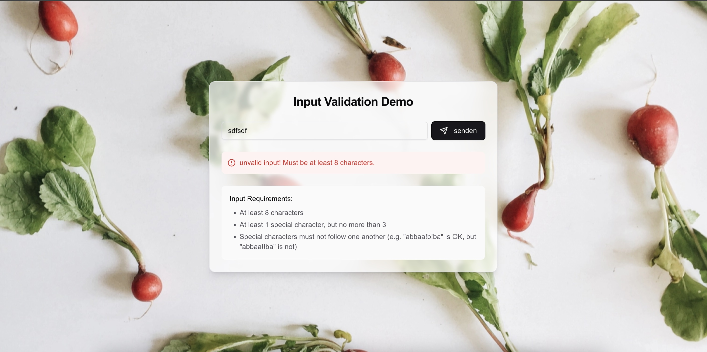
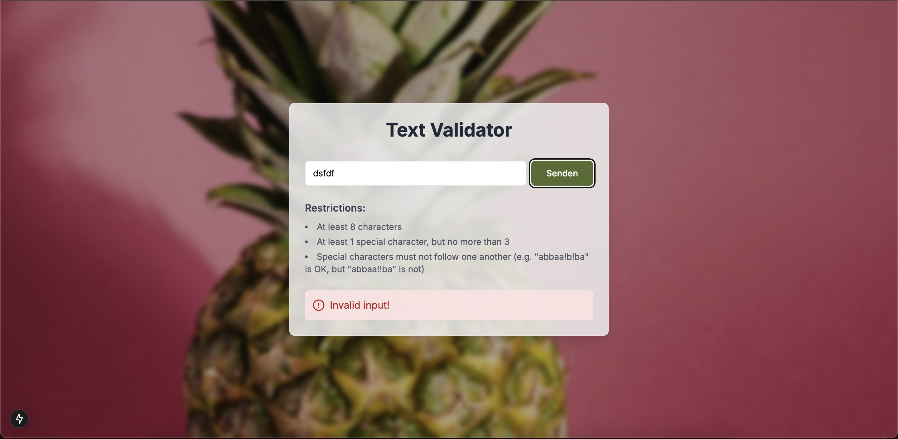
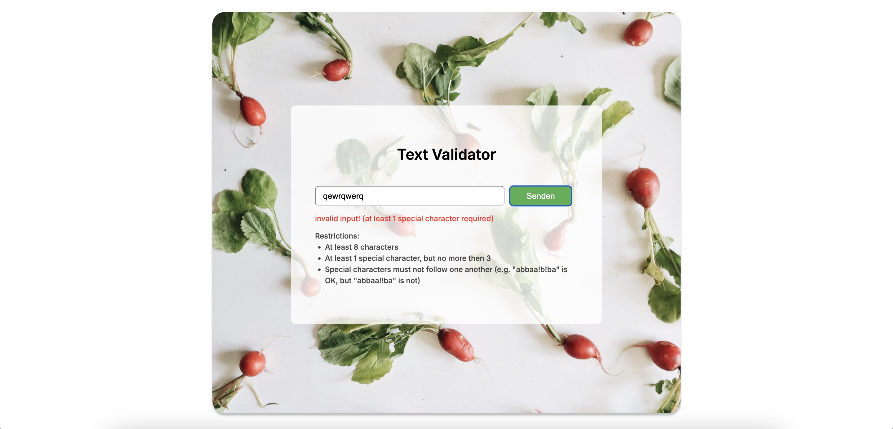

# Umgang mit KI

## Thema: Erstellt eine "Hello World"-Webseite:
Erstellen einer einfachen Single-Page Web-App (gerne - also optional -  auch mit einem Framework eurer Wahl wie z.B. Vue, Angular, react, etc.) und CSS-Styling.

Erstellt auf der Seite eine Komponente mit einer Textbox und einem "Senden"-Button und generiert ein JavaScript-Script zur Validierung von Formulareingaben. Das Ergebnis der Validierung soll prüfen, ob die Eingabe folgende Kriterien erfüllt:
- mind. 8 Zeichen
- mind. 1 Sonderzeichen, aber nicht mehr als 3, die aber nicht aufeinander folgen dürfen (z.B. "abbaa!b!ba" ist ok, "abbaa!!ba" aber nicht)

---
### 1. Recherche und Methodendefinition
Aktuell gibt es viele KI-Werkzeuge, die Aufgaben in der Web-Entwicklung vereinfachen. Die bevorzugten Ansätze lassen sich in zwei Kategorien einteilen:
- **Perspektive der Entwickler**: Tools, die durch natürliche Sprache Code und Benutzeroberflächen generieren.
- **Perspektive der Designer**: Tools, die Designs in funktionsfähigen Code umwandeln.
Beide Ansätze werden getestet und verglichen, um herauszufinden, welches für verschiedene Szenarien am besten geeignet ist.

---
### 2. Auswahl der KI-Werkzeuge, die besonders für Web-Apps geeignet sind:
Die Werkzeuge wurden nach Funktionalität in folgende Kategorien eingeteilt:

| KI Werkzeug             | Kriterien                                                                                                  | Alternative             |
|:----------------------- |:-----------------------------------------------------------------------------------------------------------|:------------------------|
|                                                                 *Aus der Perspektive der Entwickler*                                                         |||
| Claude AI Artifacts     | Live-Vorschau, jedoch ohne direkte Kontrolle über den Code und das UI                                      | V0                      |
| Cursor                  | IDE ohne Live-Vorschau. Cursor Composer ermöglicht die autonomie Bearbeitung über mehrere Dateien hinweg.  | VSCode + GitHub Copilot |
| bolt.new                | Bietet Live-Vorschau und eine Online-IDE. Vereint Code-Generierung und -Modifikation.                      | Replit Agent            |
|                                                                  *Aus der Perspektive der Designer*                                                          |||
| Figma + Locofy + Cursor | Wandelt Design in Code um und ergänzt die Funktionalität mithilfe von Cursor.                              | builder.io              |

---      
### 3. Durchführung:
Die App wird in **Next.js** entwickelt, um Erweiterbarkeit und Skalierbarkeit sicherzustellen.

Anforderungen:
- Gleiche Instruktionen in einer Datei **(instruction.md)** formuliert.
- Design wird in Figma erstellt und als Bildreferenz bereitgestellt.

#### Ergebnisse:

- **Claude AI Artifacts:**
Kostenlos, mit Live-Vorschau für einzelne HTML-Seiten oder Komponenten. Keine Kontrolle über Code oder Design, Integration in Next.js erfordert manuelle Anpassungen. Bilder als Referenz werden nicht korrekt umgesetzt, daher eher für einfache Projekte geeignet.

| Vorschau in Claude                                                     | Exported in IDE                                                         |
|------------------------------------------------------------------------|-------------------------------------------------------------------------|
|  |  |

- **Cursor:**
Eine IDE ohne Vorschau, jedoch mit automatisierter Dateistrukturierung und natürlicher Sprachsteuerung. Unterstützt sowohl direkte Codebearbeitung als auch mehrfache Datei-Modifikationen. Layout-Referenzbilder werden ebenfalls nicht korrekt interpretiert, jedoch effizient für strukturierte Projekte.

- **Bolt.new:**
Kombination aus Live-Vorschau und Online-IDE. Unterstützt sowohl Modifikation als auch Sprachsteuerung. Dateien werden automatisch strukturiert, aber Referenzbilder bleiben ungenau. Ideal für Entwickler, die Vorschau und Bearbeitung kombinieren möchten.

| Vorschau in bolt.new                                                  | Vorschau in bolt.new mit hochgeladeten Bild                           |
|-----------------------------------------------------------------------|-----------------------------------------------------------------------|
|  |  |

- **Figma + Locofy + Cursor**:
Beste Kombination für präzisen UI-Code. Locofy unterstützt Framework-Auswahl und Komponentensteuerung. Nach der Konvertierung kann der Code in Cursor weiter optimiert und funktional ergänzt werden. Vereint Design und Funktionalität mit hoher Genauigkeit.

--- 
### 4. Reflexion & Analyse
- **Qualität des Outputs:** War der generierte Code funktional und gut strukturiert? Musstet ihr manuell eingreifen oder Fehler beheben?
*Cursor > bolt.new > Figma+Locofy > Claude AI Artifacts*
  - Claude AI Artifacts:
  Nur für kleine Projekte geeignet. Der generierte Code ist nicht direkt in ein Framework wie Next.js integrierbar und erfordert eine manuelle Anpassung. Unterstützt keine komplexen Layouts oder Designreferenzen.
  - Cursor:
  Liefert funktionalen und gut strukturierten Code. Besonders hilfreich bei der Bearbeitung und Organisation komplexer Projekte durch automatische Dateistrukturierung. Die Implementierung von Designreferenzen bleibt jedoch begrenzt.
  - Bolt.new:
  Kombiniert Vorschau und Bearbeitung in einer Umgebung. Der generierte Code ist funktionsfähig, jedoch nicht immer optimal dokumentiert.
  - Figma + Locofy + Cursor:
  Der UI-Code ist hochwertig und folgt einem klaren Standard. Funktionalitäten müssen jedoch manuell ergänzt werden, was zu zusätzlichem Aufwand führen kann.

- **Effizienz**: In welchen Bereichen hat das KI-Tool wirklich geholfen, und wo war es weniger nützlich?
*Claude AI Artifacts = bolt.new > Cursor > Figma+Locofy*
  - Claude AI Artifacts:
  Gut für schnelle Prototypen, aber nicht für größere Projekte geeignet. Die manuelle Nachbearbeitung nimmt Zeit in Anspruch.
  - Cursor:
  Sehr effizient, insbesondere durch die automatische Organisation von Dateien und die Möglichkeit, mehrere Dateien gleichzeitig zu bearbeiten.
  - Bolt.new:
  Unterstützt effizientes Arbeiten durch die Integration von Vorschau und Modifikation, allerdings nicht so flexibel wie Cursor.
  - Figma + Locofy + Cursor:
  Sehr effizient für die UI-Entwicklung, da Design-to-Code-Transformationen in Minuten erfolgen können. Für die funktionale Implementierung ist jedoch zusätzlicher Aufwand erforderlich.

- **Verständlichkeit**: Habet ihr den generierten Code vollständig verstanden? Könnt ihr ihn manuell modifizieren, falls nötig?
*Cursor = bolt.new > Claude AI Artifacts > Figma+Locofy*
  - Claude AI Artifacts:
  Der generierte Code ist minimalistisch, was ihn einfach macht, aber die Integration in ein komplexeres Projekt erschwert.
  - Cursor:
  Die Arbeit ist schrittweise gut dokumentiert und leicht verständlich. Selbst Anfänger können sie mit geringem Aufwand nachvollziehen und bearbeiten.
  - Bolt.new:
  Die Arbeit ist schrittweise gut dokumentiert und leicht verständlich. Selbst Anfänger können sie mit geringem Aufwand nachvollziehen und bearbeiten.
  - Figma + Locofy + Cursor:
  Der generierte UI-Code ist präzise und nachvollziehbar. Funktionale Erweiterungen müssen jedoch tiefergehendes Verständnis erfordern.

- **Grenzen des Tools**: Gab es Bereiche, in denen das KI-Tool versagt hat? Wenn ja, warum?
*Cursor > Bolt.new > Figma+Locofy = Claude AI Artifacts*
  - Claude AI Artifacts:
  Kann keine komplexen Projektstrukturen erzeugen und unterstützt keine Layout-Bilder. Die Vorschau ist auf einfache Seiten beschränkt.
  - Cursor:
  Layout-Bilder werden nicht präzise übernommen. Außerdem ist die Einrichtung eines Projekts ohne vorgefertigte Struktur zeitaufwändiger.
  - Bolt.new:
  Die Vorschau ist nützlich, jedoch gibt es Einschränkungen bei der Verarbeitung von Design-Referenzen sowie Schwierigkeiten und Instabilitäten in der Online-IDE, insbesondere beim Hochladen von Dateien.
  - Figma + Locofy + Cursor:
  UI-Elemente werden gut umgesetzt, aber komplexere Interaktionen oder Funktionen müssen manuell ergänzt werden.

--- 
### 5. Bewertung & Empfehlung: 
Basierend auf eurer Erfahrung, bewertet den Nutzen des verwendeten KI-Tools für die Web-Entwicklung. Gebt Empfehlungen:
- **Wann und für welche Aufgaben sollte das Tool verwendet werden?**
**Empfehlung pro Tool:**
  - Claude AI Artifacts: Ideal für schnelle Prototypen oder einfache Projekte, die keine komplexen Anforderungen haben. Nicht für Frameworks wie Next.js geeignet.
  - Cursor: Sehr gut für Entwickler, die auf Effizienz und Code-Strukturierung Wert legen. Empfohlen für Projekte, die komplexe Logik erfordern.
  - Bolt.new: Vereint Effizienz und Vorschau, ideal für schnelle und dennoch komplexe Prototypen.
  - Figma + Locofy + Cursor: Perfekt für Designer, die Design-to-Code benötigen. Für Projekte, die UI- und Funktionalitätsentwicklung kombinieren, ist diese Kombination ideal.

- **In welchen Fällen wäre eine manuelle Herangehensweise vorzuziehen?**
  - Wenn genaue Layout-Details oder benutzerdefinierte Funktionen benötigt werden, die von den Tools nicht korrekt umgesetzt werden.
  - Bei der Integration von Sicherheitsmaßnahmen oder Datenschutzbestimmungen, da generierter Code oft standardisierte, aber nicht optimierte Lösungen bietet.

- **Ethische und sicherheitstechnische Überlegungen:**
  - Sicherstellen, dass der generierte Code keine sensiblen Informationen weitergibt oder Datenschutzrichtlinien verletzt.
  - Manuelle Prüfung des Codes auf potenzielle Sicherheitslücken.

